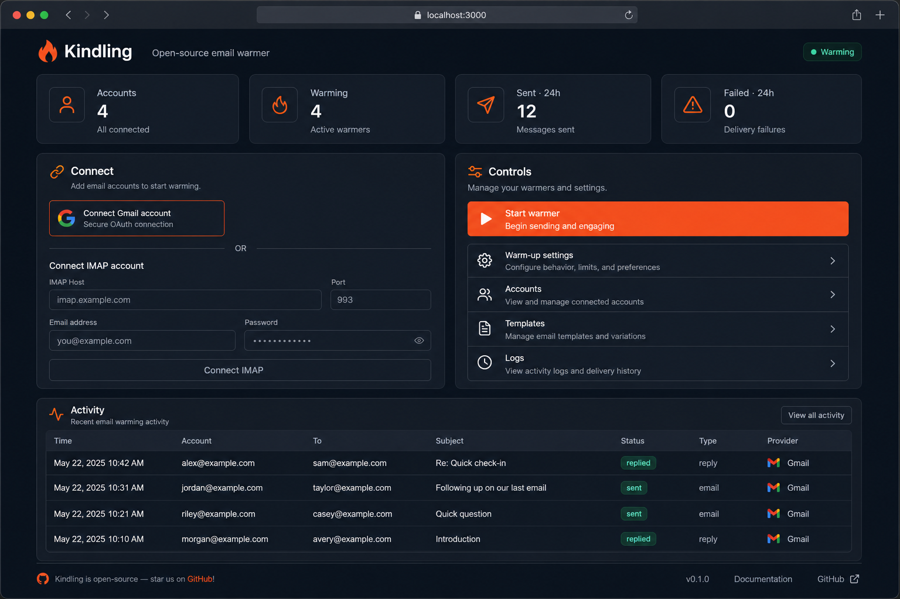
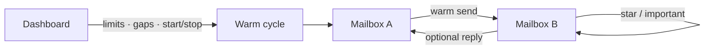

# Kindling

**Open-source email warmer** — warm a mesh of mailboxes you own before campaigns.

[](LICENSE)
[](https://www.python.org/)
[](docker-compose.yml)

Connect Gmail (OAuth or App Password) + any IMAP/SMTP inbox. Kindling rotates short human-sounding emails between them, stars/marks important on receive, and can auto-reply — with daily limits and send gaps.



> **Owned accounts only.** Not a spam tool. Warm mailboxes you control.

## Quick start (Docker)

```bash
git clone https://github.com/vibejain/kindling.git
cd kindling
cp .env.example .env
# set APP_SECRET to a long random string
docker compose up --build
```

Open [http://127.0.0.1:8787](http://127.0.0.1:8787)

## Local (venv)

```bash
python3 -m venv .venv && source .venv/bin/activate
pip install -r requirements.txt
cp .env.example .env   # set APP_SECRET
python run.py
```

## Connect accounts

| Method | When to use |
|--------|-------------|
| **Gmail OAuth** | Best once you create a Google OAuth client (`./scripts/setup_oauth.sh`) |
| **Gmail App Password** | Works immediately with [App Passwords](https://myaccount.google.com/apppasswords) |
| **IMAP/SMTP** | cPanel, workspace mail, any standard host |

Need **≥2** accounts with warming on. Start the warmer — cycles run about every 5 minutes (or hit **Run one cycle**).

## How it works



- Picks a random eligible sender → receiver from your pool
- Sends a short template email
- Receiver marks **Important / Starred** (and read)
- Optional short reply back
- Respects **daily limit** + **min gap** per account

Credentials are encrypted at rest (Fernet, derived from `APP_SECRET`) and stored in local SQLite under `data/`.

## Settings

| Setting | Default | Notes |
|---------|---------|--------|
| Daily sends / account | 4 | Ramp slowly on new domains |
| Min gap (minutes) | 45 | Space between sends from one inbox |
| Mark important | on | Star + important on receive |
| Auto-reply | on | Short reply from receiver |

## Deploy on a VPS

Same as Docker quick start. Point DNS / reverse proxy to port `8787`, set:

```env
APP_BASE_URL=https://kindling.example.com
HOST=0.0.0.0
APP_SECRET=<long-random>
```

If using Gmail OAuth, add the production callback to your Google OAuth client:

`https://kindling.example.com/auth/gmail/callback`

### One-click hosts

[](https://render.com/deploy?repo=https://github.com/vibejain/kindling)

Use the included [`render.yaml`](render.yaml). Set `APP_SECRET` and `APP_BASE_URL` in the dashboard. Attach a persistent disk at `/app/data`.

## Security

- Use only mailboxes **you own**
- Never commit `.env`, OAuth client secrets, or `data/`
- Rotate `APP_SECRET` carefully — it encrypts stored credentials
- Prefer OAuth over passwords when possible
- Bind to localhost locally; put TLS in front on a VPS

## Stack

Python · FastAPI · SQLite · APScheduler · Gmail API · IMAP/SMTP

## Contributing

PRs welcome — see [CONTRIBUTING.md](CONTRIBUTING.md). If Kindling saves you time, **star the repo** so others can find it.

## License

[MIT](LICENSE)
