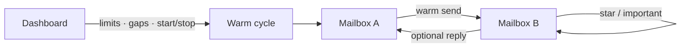

# Kindling

**Open-source email warmer** for Gmail and IMAP: warm a mesh of mailboxes you own before campaigns.

[](LICENSE)
[](https://github.com/vibejain/kindling/actions/workflows/ci.yml)
[](https://www.python.org/)
[](docker-compose.yml)

Self-hosted warmup: connect Gmail (OAuth or App Password) plus any IMAP/SMTP inbox. Kindling sends short human-sounding emails between your accounts, stars or marks them important on receive, and can auto-reply, with daily limits and send gaps.


> **Owned accounts only.** Not a spam tool. Use only mailboxes you control.

## Quick start (Docker)

```bash
git clone https://github.com/vibejain/kindling.git
cd kindling
cp .env.example .env
# set APP_SECRET to a long random string
docker compose up --build
```

Open [http://127.0.0.1:8787](http://127.0.0.1:8787)

## Local (venv)

```bash
python3 -m venv .venv && source .venv/bin/activate
pip install -r requirements.txt
cp .env.example .env   # set APP_SECRET
python run.py
```

## Environment variables

| Variable | Required | Default | Notes |
|----------|----------|---------|--------|
| `APP_SECRET` | **yes** | `dev-only-change-me` | Fernet key material for encrypted credentials. Use a long random string. |
| `APP_BASE_URL` | for OAuth / public URL | `http://127.0.0.1:8787` | Must match your browser URL (and OAuth redirect). |
| `HOST` | no | `127.0.0.1` | Use `0.0.0.0` behind Docker or a reverse proxy. |
| `PORT` | no | `8787` | HTTP port. |
| `GOOGLE_CLIENT_ID` | for Gmail OAuth | empty | From Google Cloud Console. |
| `GOOGLE_CLIENT_SECRET` | for Gmail OAuth | empty | From Google Cloud Console. |

## Connect accounts

| Method | When to use |
|--------|-------------|
| **Gmail OAuth** | Best once you create a Google OAuth client (`./scripts/setup_oauth.sh`) |
| **Gmail App Password** | Works immediately with [App Passwords](https://myaccount.google.com/apppasswords) |
| **IMAP/SMTP** | cPanel, workspace mail, any standard host |

You need **at least 2** accounts with warming on. Start the warmer (cycles about every 5 minutes) or hit **Run one cycle**.

## Architecture



1. Pick a random eligible sender and receiver from your pool.
2. Send a short template email.
3. Receiver marks **Important / Starred** (and read).
4. Optional short reply back.
5. Enforce **daily limit** and **min gap** per account.

Credentials are encrypted at rest (Fernet, derived from `APP_SECRET`) in local SQLite under `data/`. More detail: [docs/ARCHITECTURE.md](docs/ARCHITECTURE.md).

## Settings (dashboard)

| Setting | Default | Notes |
|---------|---------|--------|
| Daily sends / account | 4 | Ramp slowly on new domains |
| Min gap (minutes) | 45 | Space between sends from one inbox |
| Mark important | on | Star + important on receive |
| Auto-reply | on | Short reply from receiver |

## Deploy on a VPS

Same as Docker quick start. Point DNS / reverse proxy to port `8787`, set:

```env
APP_BASE_URL=https://kindling.example.com
HOST=0.0.0.0
APP_SECRET=<long-random>
```

If using Gmail OAuth, add the production callback to your Google OAuth client:

`https://kindling.example.com/auth/gmail/callback`

### One-click hosts

[](https://render.com/deploy?repo=https://github.com/vibejain/kindling)

Use the included [`render.yaml`](render.yaml). Set `APP_SECRET` and `APP_BASE_URL` in the dashboard. Attach a persistent disk at `/app/data`.

## Security

- Use only mailboxes **you own**. Do not warm third-party or purchased inboxes.
- Never commit `.env`, OAuth client secrets, or `data/`.
- Rotate `APP_SECRET` carefully: it encrypts stored credentials. Changing it without re-adding accounts breaks decryption.
- Prefer OAuth over passwords when possible.
- Bind to localhost locally; put TLS (and auth at the proxy) in front on a VPS.

See [SECURITY.md](SECURITY.md).

## Troubleshooting

| Symptom | Fix |
|---------|-----|
| OAuth redirect mismatch | `APP_BASE_URL` must match the URL you open and the Google redirect URI. |
| `login_failed` on App Password | Use a [Gmail App Password](https://myaccount.google.com/apppasswords), not your normal password. 2FA must be on. |
| No sends | Need ≥2 accounts with Warming **On**, then **Start warmer** or **Run one cycle**. |
| Credentials fail after restart | `APP_SECRET` changed; re-add accounts or restore the previous secret. |
| Docker healthcheck fails | Confirm the container logs show uvicorn listening on `0.0.0.0:8787`. |

## Stack

Python · FastAPI · SQLite · APScheduler · Gmail API · IMAP/SMTP

## Contributing

PRs welcome. See [CONTRIBUTING.md](CONTRIBUTING.md). If Kindling saves you time, **star the repo** so others can find it.

## License

[MIT](LICENSE)
